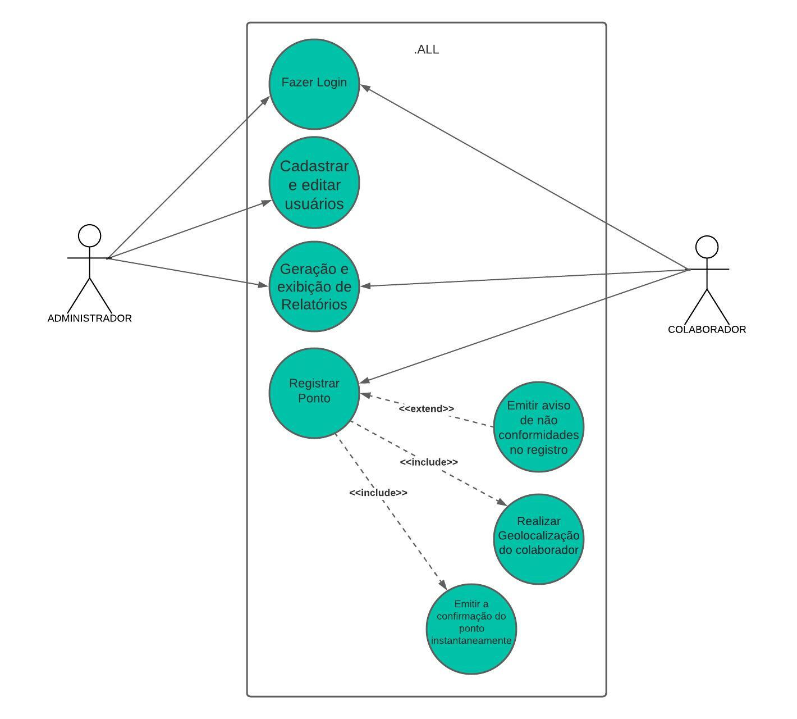
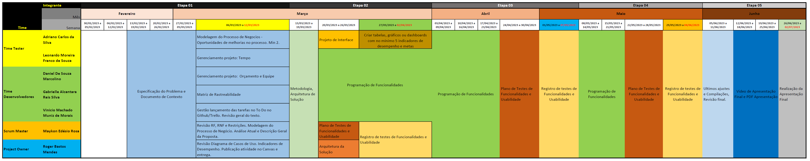
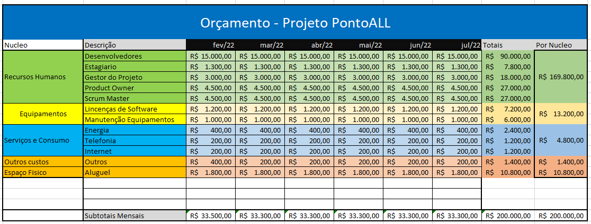

# Especificações do Projeto

Pré-requisitos: <a href="1-Documentação de Contexto.md"> Documentação de Contexto</a>

A definição exata do problema e os pontos mais relevantes a serem tratados neste projeto foram consolidadas com a participação dos usuários em um trabalho de imersão feita pelos membros da equipe a partir da observação dos usuários em seu local natural e por meio de entrevistas. Os detalhes levantados nesse processo foram  consolidados na forma de personas e histórias de usuários.
 

## Personas

As personas levantadas durante o processo de entendimento do problema são apresentadas na Figuras que se seguem.

### **`Éder Aleixo`**

|   | **CEO de Empresa de TI**   38 anos   |
|:---------------------------------------:|:-------------------------------:|
|**Principais Aplicativos Utilizados** |Visual Studio Code, QuickEdit, Linkedin, MySQL, Slack, Udacity, Eclipse, WhatsApp, Discord
|**Objetivos** |Melhoria dos processos de gerenciamento de equipes, tornar mais versátil o modelo de trabalho dos colaboradores utilizando das modalidades home office e híbrido.
|**Desafios** |Certificar que os colaboradores cumpram corretamente suas jornadas de trabalho.

### **`Mariana Ximenes`**

|   | **Gerente de Desenvolvimento**   37 anos   |
|:---------------------------------------:|:-------------------------------:|
|**Principais Aplicativos Utilizados** |Trello, Visual Studio, WhatsApp, QuickEdit, Eclipse, Linkedin
|**Objetivos** |Melhoria no gerenciamento da jornada das equipes de desenvolvimento e consulta do registro de horas trabalhadas da equipe.
|**Desafios** |Encontrar aplicações e funcionalidades que se adequem as necessidades da empresa para solucionar atuais problemas de registro.|

### **`Sandra Oliveira`**

|   | **Analista de RH**   49 anos   |
|:---------------------------------------:|:-------------------------------:|
|**Principais Aplicativos Utilizados** |MS Office, WhatsApp, Google Suite, Linkedin, Protheus
|**Objetivos** |Ter acesso aos registros de pontos de forma eletrônica e relatório de jornadas realizadas, para otimizar os processos administrativos internos.|
|**Desafios** |Assegurar que os colaboradores encontrarão facilidade na usabilidade da aplicação, de maneira simples e intuitiva.|

### **`Paola Regina`**

|   | **Assistente de Suporte**   24 anos   |
|:---------------------------------------:|:-------------------------------:|
|**Principais Aplicativos Utilizados** |Google Suite, WhatsApp, Uber, Instagram, Sublime Text, Eclipse
|**Objetivos** |Ter a jornada registrada e conseguir visualizar no sistemas as suas jornadas concluidas.|
|**Desafios** |Acesso ao relatório para conferência de registros de entrada e saída de trabalho.|
 

## Histórias de Usuários

Com base na análise das personas forma identificadas as seguintes histórias de usuários:

|EU COMO... `PERSONA`| QUERO/PRECISO ... `FUNCIONALIDADE` |PARA ... `MOTIVO/VALOR`                 |
|--------------------|------------------------------------|----------------------------------------|
|Éder Aleixo    | Gerenciar a equipe  e monitorar o cumprimento das jornadas de trabalho realizadas.| Visualizar em tempo real os registros e jornadas de cada colaborador.|
|Mariana Ximenes       | Manutenção da rotina de registro de ponto dos colaboradores. | Tornar flexivel e confiavel a marcação dos registros de ponto.  |
|Sandra Oliveira    | Obter informações gerenciais de forma rapida, para realizar processos administrativos.| Comparar a jornada realizada com a jornada do contrato de cada colaborador. |
|Paola Regina   | Registrar ponto e visualizar relatorios da sua situação do ponto e jornadas anteriores. |Conseguir registrar o ponto diariamente e ter a opção de emissão de  relatório para consultar as jornadas registradas anteriormente.|
 

## Modelagem do Processo de Negócio

### Análise da Situação Atual 

Com a implementação do trabalho remoto durante a pandemia, muitas empresas continuaram oferecendo essa opção de trabalho, seja totalmente em casa ou em um modelo híbrido. Isso criou a necessidade de controle de horas trabalhadas, horas extras, licenças e outros aspectos relacionados à gestão de pessoal. Como resultado, as empresas precisam agora de um registro de ponto para seus funcionários, tanto para fins trabalhistas quanto administrativos.
### Descrição Geral da Proposta 

A proposta da Ponto.ALL é registrar a jornada de trabalho de colaboradores independentemente da sua localização, utilizando um Relógio de ponto virtual sempre online. O serviço consiste em registrar o início e fim da jornada de trabalho, permitindo extrações para gerenciamento das jornadas dos trabalhadores. Também é possível calcular jornadas e faltas, gerando relatórios para o setor administrativo e permitindo que os colaboradores visualizem suas próprias marcações e jornadas.
### Processo 1 – NOME DO PROCESSO 

Apresente aqui o nome e as oportunidades de melhorias para o processo 1. Em seguida, apresente o modelo do processo 1, descrito no padrão BPMN. 

### Processo 2 – NOME DO PROCESSO 

Apresente aqui o nome e as oportunidades de melhorias para o processo 2. Em seguida, apresente o modelo do processo 2, descrito no padrão BPMN.

## Indicadores de Desempenho 

Apresente aqui os principais indicadores de desempenho e algumas metas para o processo. Atenção: as informações necessárias para gerar os indicadores devem estar contempladas no diagrama de classe. Colocar no mínimo 5 indicadores. 

Usar o seguinte modelo: 

Obs.: todas as informações para gerar os indicadores devem estar no diagrama de classe a ser apresentado a posteriori. 

## Requisitos

O escopo funcional do projeto é definido por meio dos requisitos funcionais que descrevem as possibilidades interação dos usuários, bem como os requisitos não funcionais que descrevem os aspectos que o sistema deverá apresentar de maneira geral. 

### Requisitos Funcionais

A tabela a seguir apresenta os requisitos do projeto, identificando a prioridade em que os mesmos devem ser entregues.

|ID    | Descrição do Requisito  | Prioridade |
|------|-----------------------------------------|----|
|RF-001 | A aplicação deverá permitir que o usuário acesse o sistema com Nome de Usuário e Senha. | ALTA |
|RF-002 | A aplicação deve permitir o registro de ponto do colaborador. | ALTA |
|RF-003 | A aplicação deve permitir que o colaborador emita relatório com relação ao seu registro de ponto e exibição das jornadas realizadas. | ALTA |
|RF-004 | A aplicação deve permitir aos administradores o gerenciamento dos colaboradores. | ALTA |
|RF-005 | A aplicação deve permitir que o administrador visualize as jornadas realizadas de todos os seus colaboradores. | ALTA |
|RF-006 | A aplicação deve executar o cálculo das jornadas trabalhadas do colaborador. | ALTA |
|RF-007 | A aplicação deve permitir a captura de geolocalização no momento de registro de ponto do colaborador. | MÉDIA |

### Requisitos não Funcionais

|ID     | Descrição do Requisito  |Prioridade |
|-------|-------------------------|----|
|RNF-001| O sistema deve ser responsivo. | ALTA |
|RNF-002| A aplicação deve informar ao usuario após todas as suas ações sucesso ou fracasso. |ALTA|
|RNF-003| Os dados do usuário devem ser armazenados em um banco de dados (Tecnologia a definir). |  ALTA |  
|RNF-004| Os relatórios devem ser exibidos na tela do sistema diretamente.|  MÉDIA | 
|RNF-005| O sistema deve buscar localização do usuário através de API de terceiros. |  MÉDIA |

## Restrições

O projeto está restrito pelos itens apresentados na tabela a seguir.

|ID| Restrição                                             |
|--|-------------------------------------------------------|
|01| O projeto deverá ser entregue até o final do semestre em 23/06/23. |
|02| Não poderão ser contratados prestadores de serviços para desenvolvimento do projeto.|
|03| Projeto terá foco na tecnologia Mobile.|

## Diagrama de Casos de Uso

Na Linguagem de modelagem unificada (UML), o diagrama de caso de uso resume os detalhes dos usuários do seu sistema (também conhecidos como atores) e as interações deles com o sistema.

O objetivo do diagrama de caso de uso em UML é demonstrar as diferentes maneiras que o usuário pode interagir com um sistema.

# Matriz de Rastreabilidade 

A matriz de rastreabilidade é uma ferramenta usada para facilitar a visualização dos relacionamento entre requisitos e outros artefatos ou objetos, permitindo a rastreabilidade entre os requisitos e os objetivos de negócio. 

A matriz deve contemplar todos os elementos relevantes que fazem parte do sistema, conforme a figura meramente ilustrativa apresentada a seguir.

  

# Gerenciamento de Projeto

O intuito deste projeto é prover um sistema que vá auxiliar com o processo de ponto de uma determinada empresa. O sistema inclui funções como relatórios de horas, gerenciamento de faltas e registros de horas trabalhadas remotamente. O sistema proposto auxiliará o colaborador a ter acesso e controle de suas informações de ponto e auxiliará a empresa a manter um histórico mais preciso dos pontos.

A Gerência de Projeto demanda não somente um conhecimento técnico, mas também uma experiência na área na qual se vai atuar. Com intuito de alcançar os requisitos funcionais e não funcionais estabelecidos da forma mais completa possível, a seguinte divisão de função foi estabelecida:

|FUNÇÃO    | NOME  | 
|------|-----------------------------------------|
|DESENVOLVEDOR| GABRIELLE ALCANTARA | 
|DESENVOLVEDOR| DANIEL MARCOLINO | 
|TESTER| LEONARDO MOREIRA   | 
|TESTER| ADRIANO CARLOS   | 
|PROJECT OWNER| ROGER BASTOS   | 
|SCRUM MASTER| MAYKON EDÉSIO   | 

O monitoramento do projeto será atráves de encontros semanais com todos do time e também com os encontros juntos ao professor.

## Gerenciamento de Tempo
  
O gerenciamento do projeto será através de um quadro Kanban (link). As atividades occorrerão dentro de uma sprint, quinze dias, e os requisitos a serem trabalhados na sprint serão retirados do backlog de acordo com o acordado com o stakeholder. A cada final de sprint, uma retrospectiva acontecerá para analisar o resultado desta sprint e uma planning para organizar os próximos requisitos a serem tratados na sprint que se inicia. Para manter um melhor controle do tempo, as reuniões semanais servirão também de auxílio caso exista algum impedimento para algum membro do time. Para essa implementação, o tempo máximo a ser respeitado é de seis meses.

## Gerenciamento de Equipe

A equipe desempenhará suas tarefas de acordo com as habilidades e características subjetivas de cada membro, a fim de que cada um contribua e produza o melhor trabalho a ser incorporado ao projeto e consequentemente ao produto final. O gerenciamento das tarefas será registrado para que a produtividade e qualidade se mantenham durante todo o desenvolvimento do projeto.

## Gestão de Orçamento 

Com base em todo o escopo produzido anteriormente, os custos do projeto serão gerenciados em conformidade com os objetivos e requisitos estabelecidos na concepção do projeto, de modo a garantir o desenvolvimento norteado pela realidade financeira pré-definida. O projeto tem o orçamento de 200 mil reais e previsção de duração para 6 meses.

## Cronogramas de tarefas a serem feitas

[Link do Trello](https://trello.com/b/kHXNCfzy/to-do)
