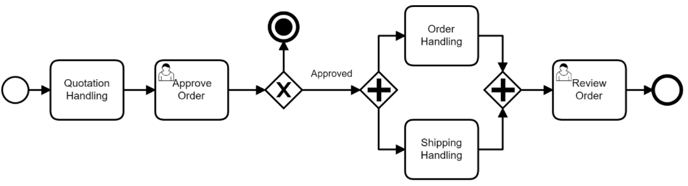

# Especificações do Projeto

Pré-requisitos: <a href="1-Documentação de Contexto.md"> Documentação de Contexto</a>

A definição exata do problema e os pontos mais relevantes a serem tratados neste projeto foram consolidadas com a participação dos usuários em um trabalho de imersão feita pelos membros da equipe a partir da observação dos usuários em seu local natural e por meio de entrevistas. Os detalhes levantados nesse processo foram  consolidados na forma de personas e histórias de usuários.
 

## Personas

As personas levantadas durante o processo de entendimento do problema são apresentadas na Figuras que se seguem.

### **`Éder Aleixo`**

|   | **CEO de Empresa de TI**   38 anos   |
|:---------------------------------------:|:-------------------------------:|
|**Principais Aplicativos Utilizados** |Visual Studio Code, QuickEdit, Linkedin, MySQL, Slack, Udacity, Eclipse, WhatsApp, Discord
|**Objetivos** |Melhoria dos processos de gerenciamento de equipes, tornar mais versátil o modelo de trabalho dos colaboradores utilizando das modalidades home office e híbrido.
|**Desafios** |Certificar que os colaboradores cumpram corretamente suas jornadas de trabalho.

### **`Mariana Ximenes`**

|   | **Gerente de Desenvolvimento**   37 anos   |
|:---------------------------------------:|:-------------------------------:|
|**Principais Aplicativos Utilizados** |Trello, Visual Studio, WhatsApp, QuickEdit, Eclipse, Linkedin
|**Objetivos** |Melhoria no gerenciamento da jornada das equipes de desenvolvimento e consulta do registro de horas trabalhadas da equipe.
|**Desafios** |Encontrar aplicações e funcionalidades que se adequem as necessidades da empresa para solucionar atuais problemas de registro.|

### **`Sandra Oliveira`**

|   | **Analista de RH**   49 anos   |
|:---------------------------------------:|:-------------------------------:|
|**Principais Aplicativos Utilizados** |MS Office, WhatsApp, Google Suite, Linkedin, Protheus
|**Objetivos** |Ter acesso aos registros de pontos de forma eletrônica e relatório de jornadas realizadas, para otimizar os processos administrativos internos.|
|**Desafios** |Assegurar que os colaboradores encontrarão facilidade na usabilidade da aplicação, de maneira simples e intuitiva.|

### **`Paola Regina`**

|   | **Assistente de Suporte**   24 anos   |
|:---------------------------------------:|:-------------------------------:|
|**Principais Aplicativos Utilizados** |Google Suite, WhatsApp, Uber, Instagram, Sublime Text, Eclipse
|**Objetivos** |Ter a jornada registrada e conseguir visualizar no sistemas as suas jornadas concluidas.|
|**Desafios** |Acesso ao relatório para conferência de registros de entrada e saída de trabalho.|
 

## Histórias de Usuários

Com base na análise das personas forma identificadas as seguintes histórias de usuários:

|EU COMO... `PERSONA`| QUERO/PRECISO ... `FUNCIONALIDADE` |PARA ... `MOTIVO/VALOR`                 |
|--------------------|------------------------------------|----------------------------------------|
|Éder Aleixo    | Gerenciar a equipe  e monitorar o cumprimento das jornadas de trabalho realizadas.| Visualizar em tempo real os registros e jornadas de cada colaborador.|
|Mariana Ximenes       | Manutenção da rotina de registro de ponto dos colaboradores. | Tornar flexivel e confiavel a marcação dos registros de ponto.  |
|Sandra Oliveira    | Obter informações gerenciais de forma rapida, para realizar processos administrativos.| Comparar a jornada realizada com a jornada do contrato de cada colaborador. |
|Paola Regina   | Registrar ponto e visualizar relatorios da sua situação do ponto e jornadas anteriores. |Conseguir registrar o ponto diariamente e ter a opção de emissão de  relatório para consultar as jornadas registradas anteriormente.|
 

## Modelagem do Processo de Negócio (NOVO - IMPLEMENTAR)

### Análise da Situação Atual (NOVO - IMPLEMENTAR)

Apresente aqui os problemas existentes que viabilizam sua proposta. Apresente o modelo do sistema como ele funciona hoje. Caso sua proposta seja inovadora e não existam processos claramente definidos, apresente como as tarefas que o seu sistema pretende implementar são executadas atualmente, mesmo que não se utilize tecnologia computacional. 

### Descrição Geral da Proposta (NOVO - IMPLEMENTAR)

Apresente aqui uma descrição da sua proposta abordando seus limites e suas ligações com as estratégias e objetivos do negócio. Apresente aqui as oportunidades de melhorias.

### Processo 1 – NOME DO PROCESSO (NOVO - IMPLEMENTAR)

Apresente aqui o nome e as oportunidades de melhorias para o processo 1. Em seguida, apresente o modelo do processo 1, descrito no padrão BPMN. 

### Processo 2 – NOME DO PROCESSO (NOVO - IMPLEMENTAR)

Apresente aqui o nome e as oportunidades de melhorias para o processo 2. Em seguida, apresente o modelo do processo 2, descrito no padrão BPMN.

## Indicadores de Desempenho (NOVO - IMPLEMENTAR)

Apresente aqui os principais indicadores de desempenho e algumas metas para o processo. Atenção: as informações necessárias para gerar os indicadores devem estar contempladas no diagrama de classe. Colocar no mínimo 5 indicadores. 

Usar o seguinte modelo: 

Obs.: todas as informações para gerar os indicadores devem estar no diagrama de classe a ser apresentado a posteriori. 

## Requisitos

O escopo funcional do projeto é definido por meio dos requisitos funcionais que descrevem as possibilidades interação dos usuários, bem como os requisitos não funcionais que descrevem os aspectos que o sistema deverá apresentar de maneira geral. 

### Requisitos Funcionais

A tabela a seguir apresenta os requisitos do projeto, identificando a prioridade em que os mesmos devem ser entregues.

|ID    | Descrição do Requisito  | Prioridade |
|------|-----------------------------------------|----|
|RF-001 | A aplicação deverá permitir que o usuário acesse o sistema com Nome de Usuário e Senha. | ALTA |
|RF-002 | A aplicação deve permitir o registro de ponto do colaborador. | ALTA |
|RF-003 | A aplicação deve permitir que o colaborador emita relatório com relação ao seu registro de ponto e exibição das jornadas realizadas. | ALTA |
|RF-004 | A aplicação deve permitir aos administradores o gerenciamento dos colaboradores. | ALTA |
|RF-005 | A aplicação deve permitir que o administrador visualize as jornadas realizadas de todos os seus colaboradores. | ALTA |
|RF-006 | A aplicação deve executar o cálculo das jornadas trabalhadas do colaborador. | ALTA |
|RF-007 | A aplicação deve permitir a captura de geolocalização no momento de registro de ponto do colaborador. | MÉDIA |

### Requisitos não Funcionais

|ID     | Descrição do Requisito  |Prioridade |
|-------|-------------------------|----|
|RNF-001| O sistema deve ser responsivo. | ALTA |
|RNF-002| A aplicação deve informar ao usuario após todas as suas ações sucesso ou fracasso. |ALTA|
|RNF-003| Os dados do usuário devem ser armazenados em um banco de dados (Tecnologia a definir). |  ALTA |  
|RNF-004| Os relatórios devem ser exibidos na tela do sistema diretamente.|  MÉDIA | 
|RNF-005| O sistema deve buscar localização do usuário através de API de terceiros. |  MÉDIA |

## Restrições

O projeto está restrito pelos itens apresentados na tabela a seguir.

|ID| Restrição                                             |
|--|-------------------------------------------------------|
|01| O projeto deverá ser entregue até o final do semestre em 23/06/23. |
|02| Não poderão ser contratados prestadores de serviços para desenvolvimento do projeto.|
|03| Projeto terá foco na tecnologia Mobile.|

## Diagrama de Casos de Uso

Na Linguagem de modelagem unificada (UML), o diagrama de caso de uso resume os detalhes dos usuários do seu sistema (também conhecidos como atores) e as interações deles com o sistema.

O objetivo do diagrama de caso de uso em UML é demonstrar as diferentes maneiras que o usuário pode interagir com um sistema.

# Matriz de Rastreabilidade (NOVO - IMPLEMENTAR)

A matriz de rastreabilidade é uma ferramenta usada para facilitar a visualização dos relacionamento entre requisitos e outros artefatos ou objetos, permitindo a rastreabilidade entre os requisitos e os objetivos de negócio. 

A matriz deve contemplar todos os elementos relevantes que fazem parte do sistema, conforme a figura meramente ilustrativa apresentada a seguir.

> **Links Úteis**:
> - [Artigo Engenharia de Software 13 - Rastreabilidade](https://www.devmedia.com.br/artigo-engenharia-de-software-13-rastreabilidade/12822/)
> - [Verificação da rastreabilidade de requisitos usando a integração do IBM Rational RequisitePro e do IBM ClearQuest Test Manager](https://developer.ibm.com/br/tutorials/requirementstraceabilityverificationusingrrpandcctm/)
> - [IBM Engineering Lifecycle Optimization – Publishing](https://www.ibm.com/br-pt/products/engineering-lifecycle-optimization/publishing/)

# Gerenciamento de Projeto (NOVO - IMPLEMENTAR)

O intuito deste projeto é prover um sistema que vá auxiliar com o processo de ponto de uma determinada empresa. O sistema inclui funções como relatórios de horas, gerenciamento de faltas e registros de horas trabalhadas remotamente. O sistema proposto auxiliará o colaborador a ter acesso e controle de suas informações de ponto e auxiliará a empresa a manter um histórico mais preciso dos pontos.

A Gerência de Projeto demanda não somente um conhecimento técnico, mas também uma experiência na área na qual se vai atuar. Com intuito de alcançar os requisitos funcionais e não funcionais estabelecidos da forma mais completa possível, a seguinte divisão de função foi estabelecida:

|FUNÇÃO    | NOME  | 
|------|-----------------------------------------|
|DESENVOLVEDOR| GABRIELLE ALCANTARA | 
|DESENVOLVEDOR| DANIEL MARCOLINO | 
|TESTER| LEONARDO MOREIRA   | 
|TESTER| ADRIANO CARLOS   | 
|PROJECT OWNER| ROGER BASTOS   | 
|SCRUM MASTER| MAYKON EDÉSIO   | 

O monitoramento do projeto será atráves de encontros semanais com todos do time e também com os encontros juntos ao professor.

## Gerenciamento de Tempo (NOVO - IMPLEMENTAR)

Com diagramas bem organizados que permitem gerenciar o tempo nos projetos, o gerente de projetos agenda e coordena tarefas dentro de um projeto para estimar o tempo necessário de conclusão.

O gráfico de Gantt ou diagrama de Gantt também é uma ferramenta visual utilizada para controlar e gerenciar o cronograma de atividades de um projeto. Com ele, é possível listar tudo que precisa ser feito para colocar o projeto em prática, dividir em atividades e estimar o tempo necessário para executá-las.

## Gerenciamento de Equipe (NOVO - IMPLEMENTAR)

O gerenciamento adequado de tarefas contribuirá para que o projeto alcance altos níveis de produtividade. Por isso, é fundamental que ocorra a gestão de tarefas e de pessoas, de modo que os times envolvidos no projeto possam ser facilmente gerenciados. 

## Gestão de Orçamento (NOVO - IMPLEMENTAR)

O processo de determinar o orçamento do projeto é uma tarefa que depende, além dos produtos (saídas) dos processos anteriores do gerenciamento de custos, também de produtos oferecidos por outros processos de gerenciamento, como o escopo e o tempo.

