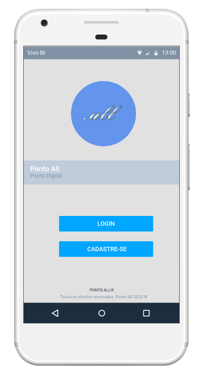
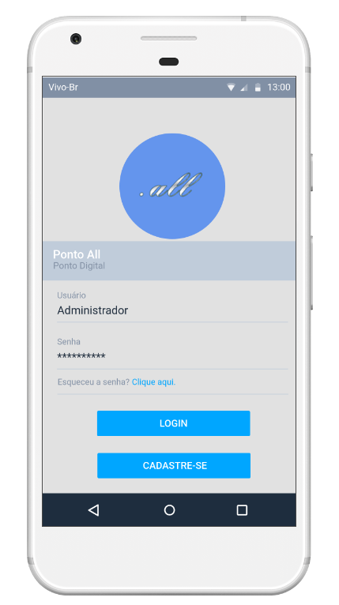
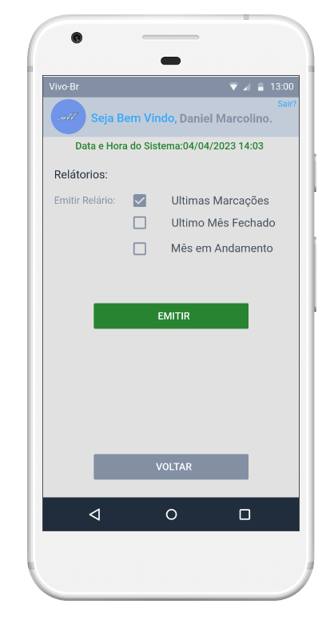

# Projeto de Interface

Pré-requisitos: <a href="2-Especificação do Projeto.md"> Documentação de Especificação</a>

Visão geral da interação do usuário pelas telas do sistema e protótipo interativo das telas com as funcionalidades que fazem parte do sistema (wireframes).

 Apresente as principais interfaces da plataforma. Discuta como ela foi elaborada de forma a atender os requisitos funcionais, não funcionais e histórias de usuário abordados nas <a href="2-Especificação do Projeto.md"> Documentação de Especificação</a>.

## Diagrama de Fluxo

O Fluxo de usuário (User Flow) foi desenvolvido para mapear todas as telas do site e traçar os possíveis caminhos e ações dos usuarios, bem como, elucidar as trilhas de acesso de acordo com os niveis de acesso baseados no cadastro dos mesmos. 

### Fluxo de Administradores

### Fluxo de Colaboradores

## Wireframes

### Tela inicial:

### Tela de Login:

### Tela Inicial Usuario

### Tela Inicial Administrador

### Tela Registro de Ponto

### Tela Aviso - Sucesso na marcação

### Tela Aviso - Erro na marcação

### Tela Relátorios

São protótipos usados em design de interface para sugerir a estrutura de um site web e seu relacionamentos entre suas páginas. Um wireframe web é uma ilustração semelhante do layout de elementos fundamentais na interface.
 
> **Links Úteis**:
> - [Protótipos vs Wireframes](https://www.nngroup.com/videos/prototypes-vs-wireframes-ux-projects/)
> - [Ferramentas de Wireframes](https://rockcontent.com/blog/wireframes/)
> - [MarvelApp](https://marvelapp.com/developers/documentation/tutorials/)
> - [Figma](https://www.figma.com/)
> - [Adobe XD](https://www.adobe.com/br/products/xd.html#scroll)
> - [Axure](https://www.axure.com/edu) (Licença Educacional)
> - [InvisionApp](https://www.invisionapp.com/) (Licença Educacional)
