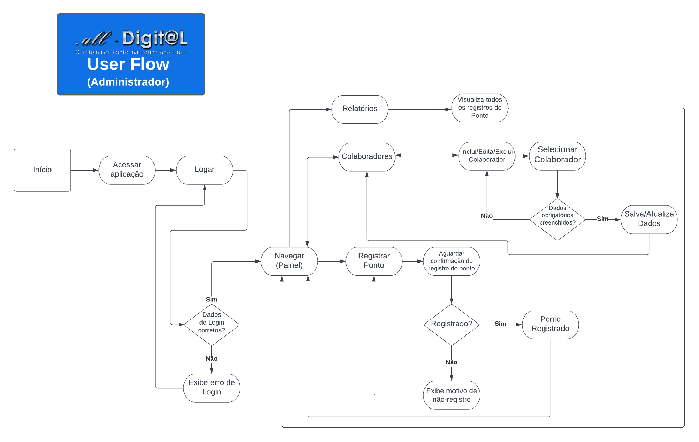
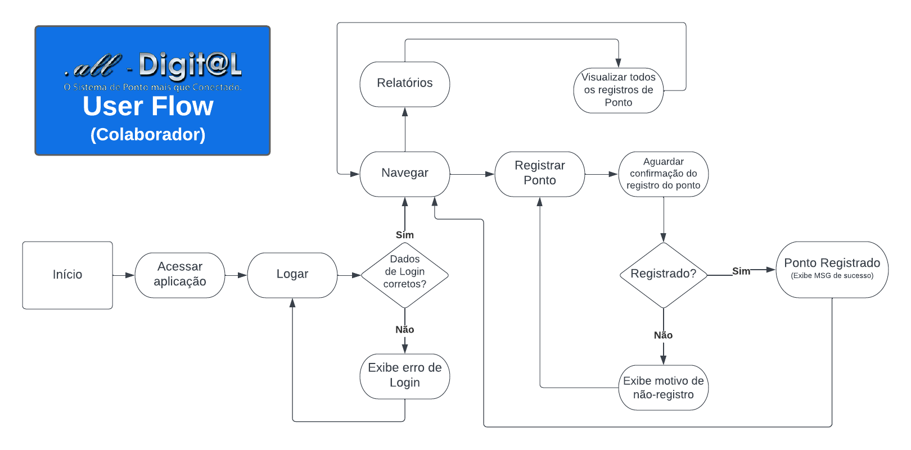

# Projeto de Interface

Pré-requisitos: <a href="2-Especificação do Projeto.md"> Documentação de Especificação</a>

Visão geral da interação do usuário pelas telas do sistema e protótipo interativo das telas com as funcionalidades que fazem parte do sistema (wireframes).

 Apresente as principais interfaces da plataforma. Discuta como ela foi elaborada de forma a atender os requisitos funcionais, não funcionais e histórias de usuário abordados nas <a href="2-Especificação do Projeto.md"> Documentação de Especificação</a>.

## Diagrama de Fluxo

O Fluxo de usuário (User Flow) foi desenvolvido para mapear todas as telas do site e traçar os possíveis caminhos e ações dos usuarios, bem como, elucidar as trilhas de acesso de acordo com os niveis de acesso baseados no cadastro dos mesmos. 

### Fluxo de Administradores

### Fluxo de Colaboradores

## Wireframes
\
\
Apresentamos os Wireframes do sistema com as telas previstas.

### Tela inicial:
\
A tela inicial apresenta a Logo e abaixo o titulo com o nome da aplicação e em seguida o subtitulo que reforça a função da aplicação, abaixo temos os botões com os comandos de Login e Cadastre-se.
\
\

### Tela de Login:
\
A tela de login exibe o campo para inserir o Usuário e a Senha. Alem das informações da tela inicial. Temos a opção para recuperar senha neste artefato tambem.
\
\

### Tela Inicial Usuario:
\
A tela apresenta a logo na parte superior, bem como a mensagem de boas vindas com o nome do usuario e abaixo as opções de menu disponiveis para o tipo de usuario Logado. Temos tambem o botão Sair para encerrar a seção.
\
\

### Tela Inicial Administrador:
\
A tela apresenta a logo na parte superior, bem como a mensagem de boas vindas com o nome do usuario e abaixo as opções de menu disponiveis para o tipo de usuario Logado. Temos tambem o botão Sair para encerrar a seção.
\
\

### Tela Registro de Ponto:
\
Nesta tela é apresentada a localização do dispositivo e os botões para realizar o registro do ponto e voltar para o menu anterior. Temos tambem o botão Sair para encerrar a seção.
\
\

### Tela Aviso - Sucesso na Marcação:
\
Nesta tela temos a mensagem do sistema confirmando o registro com sucesso do ponto.
\
\

### Tela Aviso - Erro na Marcação:
\
Nesta tela temos a mensagem do sistema informando que ocorreu um erro no registro e que o usuário deve entrar em contato com o RH da sua empresa e relatar o erro.
\
\

### Tela Relátorios:
\
Esta tela exibe as opções de Relatorios que o sistema consegue gerar (esperado).
\
\

### Tela Gerenciar Colaborador:
\
Esta tela exibe as opções de Relatorios que o sistema consegue gerar (esperado).
\
\
![Exemplo de Wireframe] A inserir...
