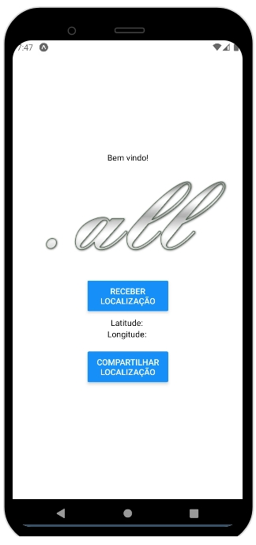
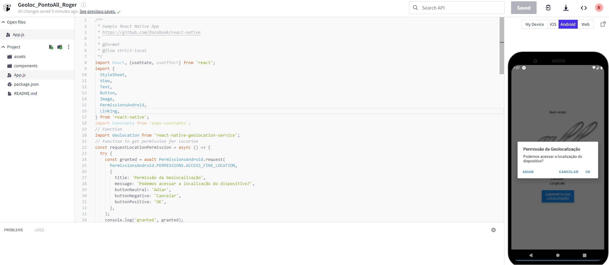
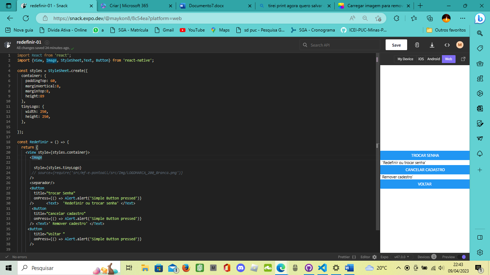
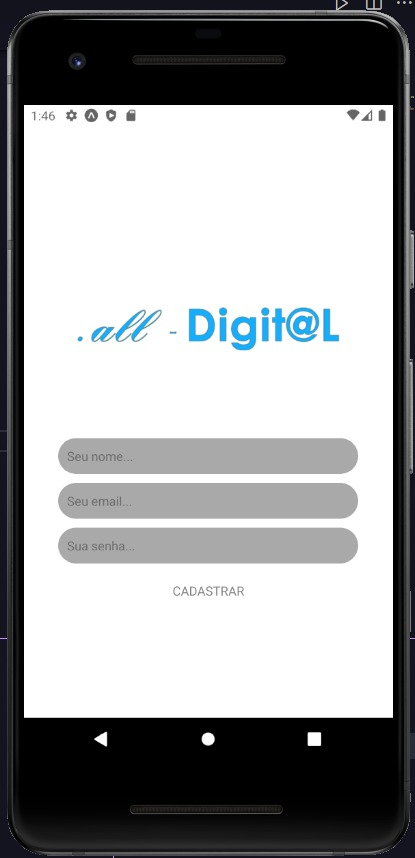
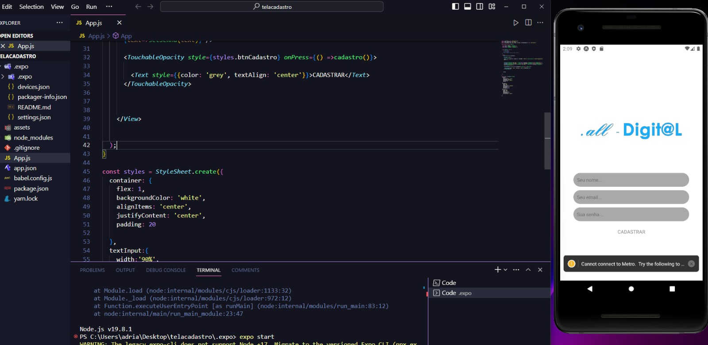

# Programação de Funcionalidades

Pré-requisitos: <a href="2-Especificação do Projeto.md"> Especificação do Projeto</a>, <a href="3-Projeto de Interface.md"> Projeto de Interface</a>, <a href="4-Metodologia.md"> Metodologia</a>, <a href="3-Projeto de Interface.md"> Projeto de Interface</a>, <a href="5-Arquitetura da Solução.md"> Arquitetura da Solução</a>

Implementação do sistema descritas por meio dos requisitos funcionais e/ou não funcionais. Deve relacionar os requisitos atendidos os artefatos criados (código fonte) além das estruturas de dados utilizadas e as instruções para acesso e verificação da implementação que deve estar funcional no ambiente de hospedagem.

Para cada requisito funcional, pode ser entregue um artefato desse tipo

### Roger Mendes - Geolocalização ###

Fiquei responsável pela Geolocalização, onde o usuário ao registrar o ponto, deverá ser possível capturar a geolocalização do mesmo via API, como exemplificado nas imagens abaixo.

Após captura, deverá retornar o local na tela. Estou trabalhando para que ao invés de mostrar a localização por ponto geográfico (LAT, LONG), mostrar o nome do endereço, cidade e país.

[Tela Geolocalização]

[Código Geolocalização]

### Maykon Edésio - Redefinir senha e excluir ###

[Código Exclusão]

 

### Adriano Carlos - Tela de Cadastro ###
 

[Tela Cadastro de Usuário]

[Código Cadastro de Usuário]

