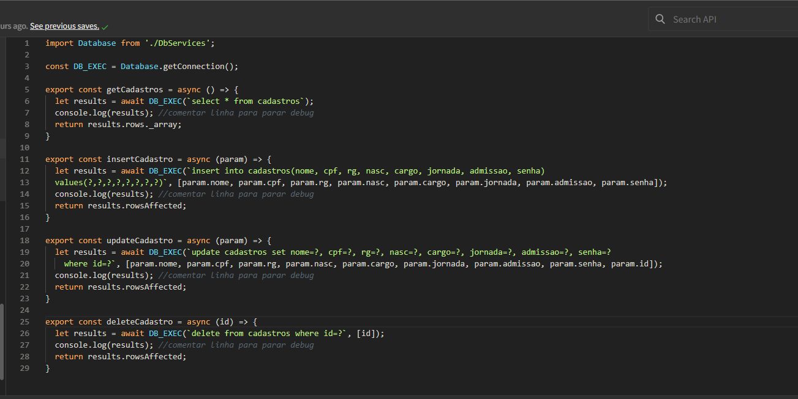
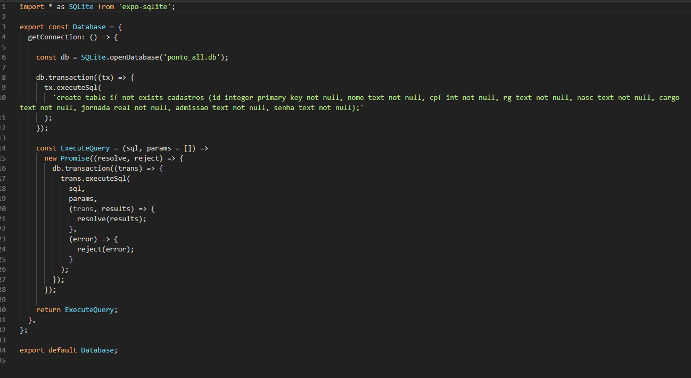
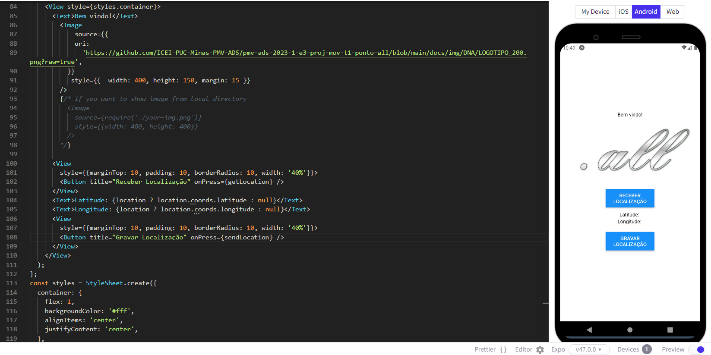
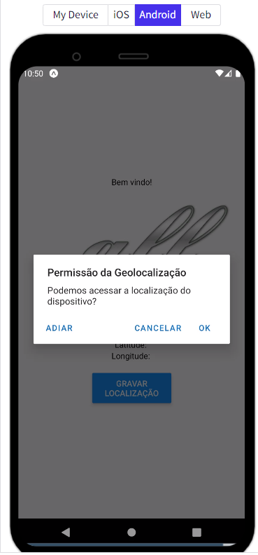

# Programação de Funcionalidades

Pré-requisitos: <a href="2-Especificação do Projeto.md"> Especificação do Projeto</a>, <a href="3-Projeto de Interface.md"> Projeto de Interface</a>, <a href="4-Metodologia.md"> Metodologia</a>, <a href="3-Projeto de Interface.md"> Projeto de Interface</a>, <a href="5-Arquitetura da Solução.md"> Arquitetura da Solução</a>

Implementação do sistema descritas por meio dos requisitos funcionais e/ou não funcionais. Deve relacionar os requisitos atendidos os artefatos criados (código fonte) além das estruturas de dados utilizadas e as instruções para acesso e verificação da implementação que deve estar funcional no ambiente de hospedagem.

Para cada requisito funcional, pode ser entregue um artefato desse tipo

### Requisitos Funcionais

A tabela a seguir apresenta os requisitos do projeto, identificando a prioridade em que os mesmos devem ser entregues.

|ID    | Descrição do Requisito  | Artefato(s) produzido(s) |
|------|-----------------------------------------|----|
|RF-001 | A aplicação deverá permitir que o usuário acesse o sistema com Nome de Usuário e Senha. | Home.js / Login.js / Auth.js / Route.js / webapi.services.js / Auth.services.js /urls.js |
|RF-002 | A aplicação deve permitir o registro de ponto do colaborador. | Mark.js |
|RF-003 | A aplicação deve permitir que o colaborador emita relatório com relação ao seu registro de ponto e exibição das jornadas realizadas. | Relatorio.js |
|RF-004 | A aplicação deve permitir aos administradores o gerenciamento dos colaboradores. | Users.js |
|RF-005 | A aplicação deve permitir que o administrador visualize as jornadas realizadas de todos os seus colaboradores. | Relatorio.js|
|RF-006 | A aplicação deve executar o cálculo das jornadas trabalhadas do colaborador. | Mark.js / Relatorio.js |
|RF-007 | A aplicação deve permitir a captura de geolocalização no momento de registro de ponto do colaborador. | Mark.js / Login.js |

## Tela Inicial

Atualização tela em 11/06.

- Tela de responsabilidade de Daniel Marcolino. Implementada a melhoria no design e personalização dos campos de login.

- Correção botões da tela. (fluxo navegação entre Login e Registro)

- Implantação da Logo Ponto ALL na tela inicial

- Tela já faz CRUD com o envio de informações de login para a API.

Video:

<video src="docs/img/Andamento 121D/Ver 1-2-1D - Snack - 11 June 2023.mp4"></video>

<video src="https://www.loom.com/share/283d9e7e4c4f4b089d85510a7e3b9f31"></video>

https://www.loom.com/share/283d9e7e4c4f4b089d85510a7e3b9f31

https://github.com/ICEI-PUC-Minas-PMV-ADS/pmv-ads-2023-1-e3-proj-mov-t1-ponto-all/blob/83c6f37ec753ab25b98ecc44f468f124dade461b/docs/img/Andamento%20121D/Ver%201-2-1D%20-%20Snack%20-%2011%20June%202023.mp4

## Tela Logado

Atualização tela em 11/06.

- Tela de responsabilidade de Daniel Marcolino. 
- Implementada a melhoria no design e personalização dos campos de login.

- Apos inserir os dados de acesso ao sistema o usuario terá acesso aos menus na parte inferior da tela.

(Falta otimizar esta tela e substituir as informações de login pela mensagem de boas vindas)

## Tela de Registro de Usuario

Atualização tela em 11/06.

- Tela de responsabilidade de Daniel Marcolino. 

- Implementada a melhoria no design e personalização dos campos de cadastro.

## Tela Meus Dados

Atualização tela em 11/06.

Tela excluida do sistema.

## Tela Relatorio

Atualização tela em 11/06.

- Tela de responsabilidade de Leonardo. 

- Implementada a melhoria no design e personalização dos campos exibidos.

## Tela Registro de Ponto

Atualização tela em 11/06.

- Tela de responsabilidade de Roger e Maykon. 
- Melhorias de design.
- Inicio da implantação da logica do registro de ponto.
- Preparação para receber os dados de Geolocalização no ato do registro de ponto.

## Tela Colaboradores

Atualização tela em 11/06.

## Implantação ServicesDB (Daniel - Login e Autenticação)

Em andamento...

Atualização tela em 11/06.

Implentação suspensa.

## Implantação DB Transactions (Daniel - Login e Autenticação)

Em andamento...
Atualização tela em 11/06.

Implentação suspensa.

## Implantação Coordenadas MapView (Roger - Geolocalização)

Atualização tela em 23/06.

Implentação não finalizada.

## Implantação serviço de API e Auth via Json Server Auth

Atualização tela em 11/06.

### Serviço de WEB API (Back-end)

Implementado por Daniel Marcolino.

SERVICES/webapi.services.js

SERVICES/auth.services.js

SERVICES/mark.services.js

CONTEXTS/UserCOntext.js

SERVICES/urls.js

### Serviço de Rotas

NAVIGATIONS/Route.js

NAVIGATIONS/Auth.js

NAVIGATIONS/Main.js

# Problemas encontrados

- Impossivel usar o REST CLIENT no VC Code, contornamos com o uso do Postman.

- Consegui abrir e instalar corretamente o localTunnel e funcionou apenas no primeiro dia. Contornamos utilizando a aplicação com o backend rodando via localhost na porta 3000 ou 3004.

LocalTunnel criado corretamente e funcional (apenas o dia 01)
Depois só dava erro 404.

- Tivemos problema para enternder a logica de como compartilhar o codigo programado e criado no EXPO.DEV.

Neste ponto a dificuldade foi grande, pois realizadas as exportações e importações para o Github, ao realizar a correta re-exportação para outra maquina, o sistema não mais funciona de forma alguma.

